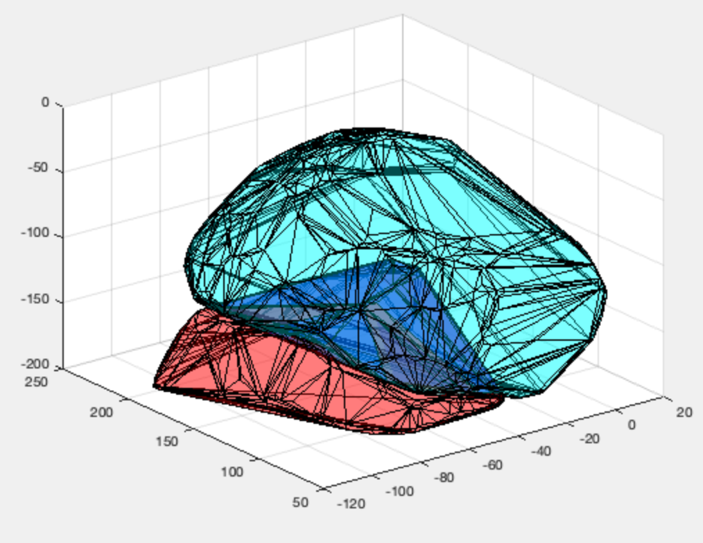
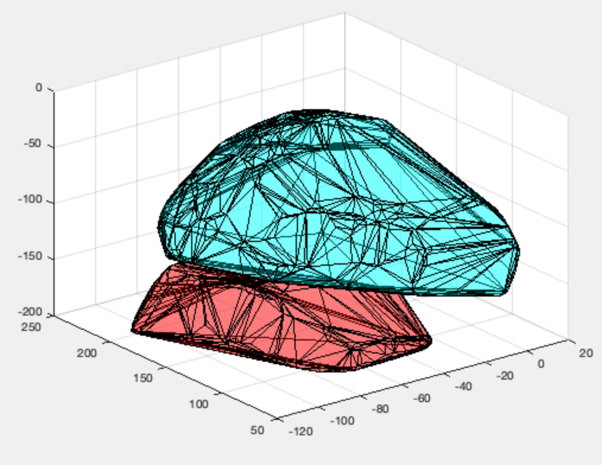

# Geometry library
Contains three submodules.
- **points.h** : 3D points and basic functions. Add, subtract, dot and cross products, ...
- **gtests.h** : Geometrical tests. Orientation, incircle, ... point_in_triangle, ... segment_intersect_triangle, ... Both robust (TOL_boundary = 0) and non-robust branches for each function.
- **convh.h** : Convex hulls. Robust implementation of quickhull algorithm, intersection of convex hulls, ...
  
The robust tests use *Shewchuck's Robust Predicates*.

## Example: removing intersection of two convex hulls
(Plots made in MATLAB).

