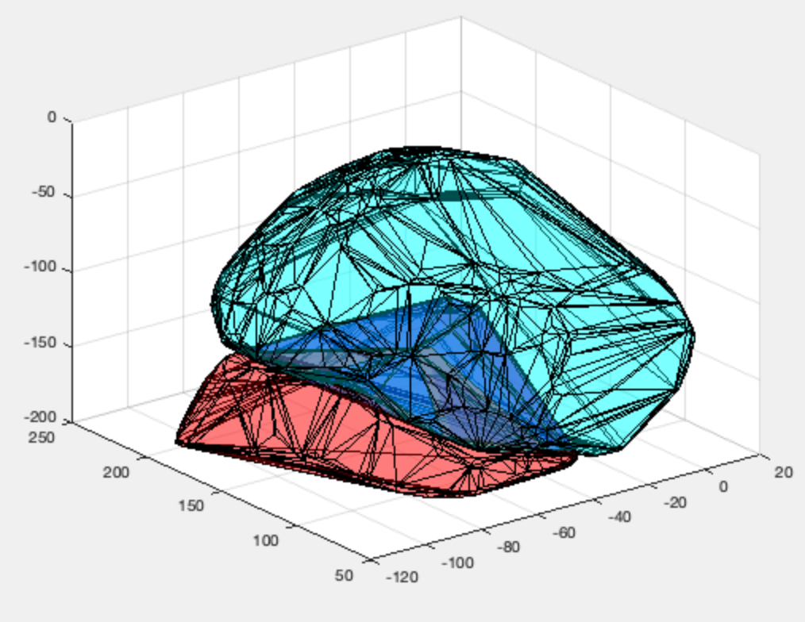
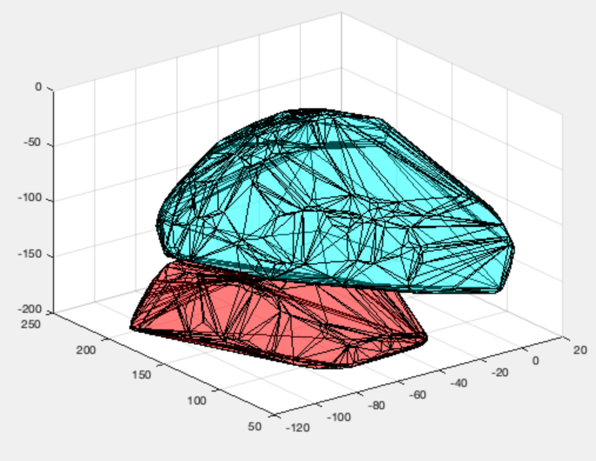

# Geometry library

A small C computational-geometry library: points, robust/exact geometric
predicates, convex hulls, and triangle meshes.

## Layout

- `include/`, `src/` -- the library's own code.
- `external/` -- vendored third-party dependencies, with the corresponding 
  wrappers and code written with their functionality. Currently:
  `external/robust_predicates` (exact orientation/insphere/power/LP predicates)
  and `external/implicit_predicates` (exact predicates over points that may
  be an implicit linear combination of other points -- see below).

## Core modules (always built)

- **points.h** : 3D points and basic functions -- add, subtract, dot and cross products, ...
- **gtests.h** : Geometrical tests -- orientation, incircle, point_in_triangle,
  segment_intersect_triangle, ... All functions are robust, and some offer a numerical
  tolerance branch.
- **convh.h** : Convex hulls -- robust quickhull implementation, intersection of convex hulls, ...
- **trimesh.h** : Closed, oriented triangle surface meshes with face-face adjacency, plus repair.

## Optional modules (CMake flag required)

Each of these is gated behind a CMake option, OFF by default.
| Header | CMake option | 
|---|---|
| `gtests.h`'s power/orthosphere predicates | `GEOMETRY_COMPILE_TESTS_POWER` | 
| `lp.h` (2D/3D linear-feasibility predicates + Seidel LP)  | `GEOMETRY_COMPILE_LP` |
| `gtests_implicit.h` (indirect/implicit-point predicates) | `GEOMETRY_COMPILE_TESTS_IMPLICIT` |

Enable what you need at configure time, e.g.:
```
cmake -B build -DGEOMETRY_COMPILE_LP=ON -DGEOMETRY_COMPILE_TESTS_IMPLICIT=ON
```

**gtests_implicit.h** -- exact arithmetic over points that may be explicit or
an implicit linear combination (LNC) of two prior points. Backed by
`external/implicit_predicates` (Attene, "Indirect predicates for geometric
constructions" -- see that directory's README for the paper). All state lives
in a caller-owned registry; no globals, so independent builds (e.g. one per
thread) can each own their own.

**lp.h** -- exact LP-feasibility predicates (2D and 3D) for a tagged
constraint (triangle/tet face vs. seed bisector), plus Seidel's randomized
incremental LP-feasibility algorithm (`lp2_vcell_hits_face`) in 2D. Tailored for
voronoi constructions.

## Example: removing intersection of two convex hulls
<p align="center">


</p>
